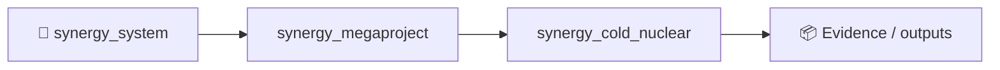
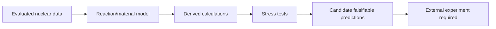

# COLD NUCLEAR — reproducible computation repository

**Status:** computational research programme. **Not proof of LENR, cold fusion, or anomalous transmutation.**

This repository collects reproducible calculations developed around:

1. low-energy D–D fusion / materials-enhanced screening consistency checks;
2. solid vs molten metal hypotheses;
3. Pd–rare-earth alloys (Pd–La, Pd–Ce, Pd–Y, Pd–Nd, Pd–Gd);
4. isotope reaction / decay networks and element-to-element transmutation;
5. a causal / multiway graph layer inspired by `Shtenco/info_graph_theory`;
6. replacement of hand-entered nuclear constants by evaluated nuclear-data and transport toolchains.

## Scientific rule

Every quantity should be labelled as one of:

- **EVALUATED / MEASURED** — imported from an external evaluated dataset or experiment;
- **DERIVED** — follows from stated equations and inputs;
- **STRESS TEST** — deliberate extrapolation used to expose sensitivity;
- **HYPOTHESIS** — phenomenological parameter or unvalidated mechanism;
- **LEGACY** — historical calculation retained for audit, not endorsed as physical truth.

A numerical model is never treated as evidence that a nuclear process occurs in nature.

## Repository layout

```text
models/
  transmutation_phase_audit.py
  transmutation_time_fingerprint.py
  nuclear_graph_consistency.py
  molten_lenr_screen.py
  pareto_alloy_selection.py
  pareto_composition_selection.py

results/
  master/
  molten/
  transmutation/
  time_fingerprints/
  graph/
  selection/

research/
  COMPUTATIONAL_STACK.md
  GRAPH_ARCHITECTURE.md
  SCIENTIFIC_BOUNDARIES.md

legacy/2026-08-08/
  audited historical model snapshots
```

## Current numerical findings

### D–D / screening

The master audit reproduces a Bosch–Hale-style D–D baseline and separately evaluates a **naive low-temperature screening extrapolation**. The latter is explicitly marked invalid as a reactor prediction; it is retained only as a sensitivity/stress test.

Current consolidated run:

```text
Calibrated low-energy D-D S0 = 113.572 keV*b
Bare D-D @ 300 K: log10(P) = -247.609 W/m^3
Naive Ue=1.7 keV @ 300 K: log10(P) = +16.716 W/m^3
                              ^ STRESS TEST / unphysical extrapolation
```

The gap is exactly why the beam-derived screening parameter must not simply be treated as thermal energy available throughout a room-temperature metal.

### Molten metals

The molten branch does **not** copy crystalline defects into the liquid. It replaces them with D loading, short-range order, electronic response, local coordination and an active space-time fraction.

A 400,000-point generic liquid-state scan produced 5,541 points in the phenomenological 1 mW–10 W/cm³ window. This does **not** validate those states; it identifies where the hypothesis would need nuclear-product falsification.

Top 50:50 molten experimental-priority heuristic:

```text
Pd-La  0.98153
Pd-Ce  0.97359
Pd-Y   0.96222
Pd-Nd  0.95983
Pd-Gd  0.95536
```

### Transmutation

The transmutation audit separates reaction identity / radioactive decay from the source strength of nuclear events and from phase-dependent materials effects.

For natural-isotope 50:50 alloys, the fraction of modeled thermal absorptions that eventually change chemical element within the audit horizon is:

```text
Pd-La  70.6698 %
Pd-Y   43.8413 %
Pd-Ce  38.9883 %
Pd-Nd   4.7972 %
Pd-Gd   0.0091 %
```

Gd is therefore an important negative control: enormous absorption does not imply efficient production of a different chemical element.

### Time fingerprints

The capture→radioactive-intermediate→daughter model now publishes complete time curves. At the normalized reference source used only for comparison, the intermediate maxima occur near:

```text
139La -> 140La -> 140Ce : 31.94 d
89Y   -> 90Y   -> 90Zr  : 56.48 d
108Pd -> 109Pd -> 109Ag : 11.58 d
140Ce -> 141Ce -> 141Pr : 608.61 d
```

Crossing liquidus with the **same** source changes these values only smoothly. A sharp phase-correlated experimental change must therefore come from a changed event/source term, spectrum, transport or another state-dependent variable — not from decay mathematics.

### Causal graph consistency gate

The graph implementation reproduces the independent tabular weighted-cross-section calculation with maximum absolute discrepancies of approximately:

```text
total capture weight : 7.1e-15 barn
change weight        : 1.1e-16 barn
change fraction      : 8.0e-17
```

`table_graph_gate_pass = true`.

This is the first direct reuse of the `info_graph_theory` philosophy: an independent representation must reconstruct the same finite observable before any new hypothesis edge is allowed.

### Pareto selection

For the five **50:50** Pd–RE candidates, `Pd50-La50` strictly dominates the other four simultaneously in:

- molten experimental-priority heuristic;
- fraction of absorptions that change element;
- effective element-change cross section per alloy atom.

When composition is expanded to 25/75, 50/50 and 75/25, the non-dominated Pareto front contains:

```text
Pd50-La50
Pd25-La75
```

So the current computational programme has narrowed from “all precious / rare-earth melts” to a much more focused **Pd–La composition family**, while Pd–Y and Pd–Ce remain useful independent diagnostic controls.

## Reproducibility policy

Large Monte-Carlo tables are **generated, not hand-edited**. The repository stores source code, seeds, scan bounds, compact CSV/JSON summaries and run logs. Very large deterministic raw tables may be omitted from Git history when they can be regenerated exactly from committed code and seed.

## Target computational stack

```text
CALPHAD / phase thermodynamics
          ↓
DFT / electronic structure
          ↓
MD / liquid short-range structure and D distribution
          ↓
material-state graph
          ↓
ENDF/GNDS nuclear data → transport / reaction rates
          ↓
decay network / isotope inventory
          ↓
causal multiway verification graph
```

Verified public repositories already mapped into this architecture include OpenMC, LLNL FUDGE, radioactivedecay, pycalphad, Quantum ESPRESSO, LAMMPS, DeePMD-kit and pynucastro. See `research/COMPUTATIONAL_STACK.md`.

## Initial consolidated calculations

- D–D Bosch–Hale/Gamow consistency table;
- screening enhancement sensitivity table;
- branch-A / branch-B phenomenological summaries;
- neutron-budget consistency table;
- corrected one-group Hg→Au / Ir→Pt / Ru→Rh audit;
- molten precious × rare-earth alloy ranking;
- Pd–La / Pd–Y / Pd–Ce / Pd–Nd / Pd–Gd natural-isotope transmutation ranking;
- below/above-liquidus phase sensitivity table;
- parent/intermediate/daughter time fingerprints;
- causal graph consistency test;
- 50:50 and composition-level Pareto selection.

Consolidation date: **2026-08-08**.


<!-- SYNERGY-FEDERATION-PASSPORT:START -->
---

## 🧭 SYNERGY federation passport

**Домен:** 🔬 Scientific computation R&D  
**Архитектурный родитель:** [`synergy_megaproject`](https://github.com/Shtenco/synergy_megaproject)  
**Архитектурный корень:** [`synergy_system`](https://github.com/Shtenco/synergy_system)



Эта диаграмма фиксирует место в документационной федерации. Реальная code/runtime dependency должна подтверждаться отдельными артефактами.

### Навигация

- [📚 Атлас всех 75 репозиториев](https://github.com/Shtenco/synergy_system/blob/main/docs/SYNERGY_REPOSITORY_ATLAS.md)
- [🧾 Машиночитаемый registry](https://github.com/Shtenco/synergy_system/blob/main/registry/SYNERGY_REPOSITORIES.json)
- [🧭 SYNERGY SYSTEM](https://github.com/Shtenco/synergy_system)

### Evidence rule

`GREEN` присваивается только воспроизводимым утверждениям. Исследовательский код, диаграмма или заявленная метрика без проверяемого artifact trail остаются `R&D/CANDIDATE`.

<!-- SYNERGY-FEDERATION-PASSPORT:END -->

---

# ⚛️ Глубокий научный паспорт Cold Nuclear

## Уже правильная научная дисциплина

Repo чётко разделяет `EVALUATED/MEASURED`, `DERIVED`, `STRESS TEST`, `HYPOTHESIS`, `LEGACY`. Это нужно сохранить как обязательный schema-level статус каждого результата.



## Ключевой пример правильного negative control

Naive low-temperature screening extrapolation даёт огромный численный эффект и одновременно явно помечается как unphysical stress test. Именно это предотвращает превращение модели в псевдоэкспериментальное утверждение.

## Следующий рубеж

заменять phenomenological inputs evaluated datasets → uncertainty propagation → preregister nuclear-product signatures → blind experimental comparison. До этого никаких заявлений о подтверждении LENR.
